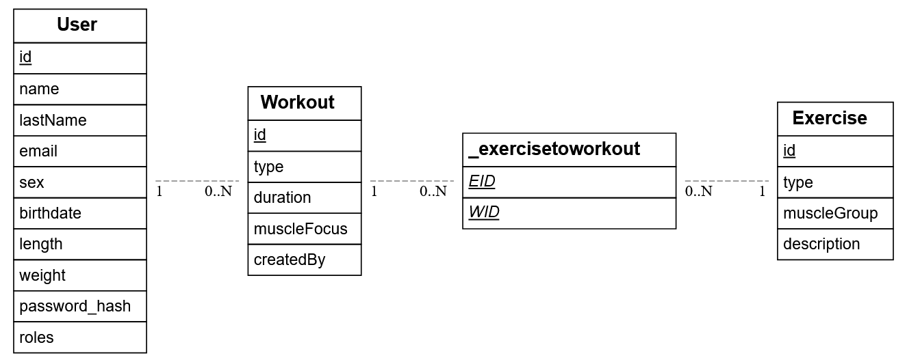
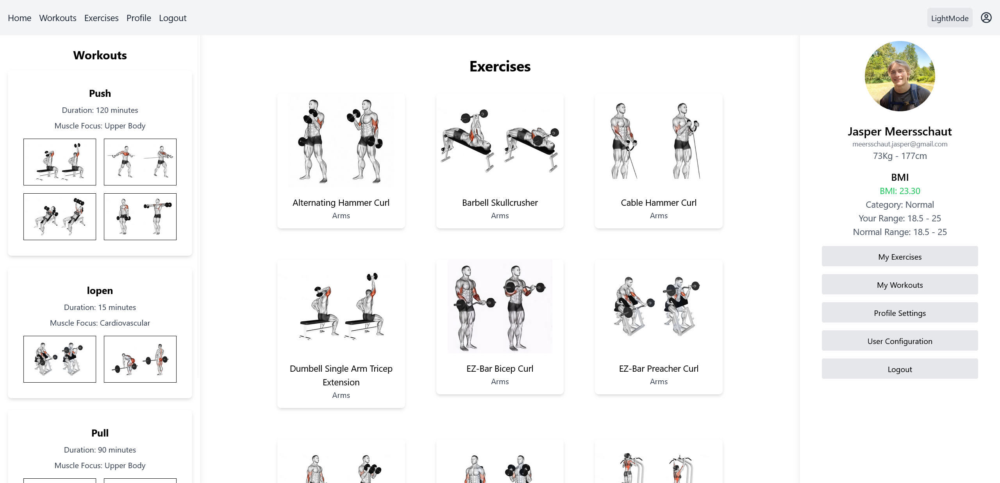
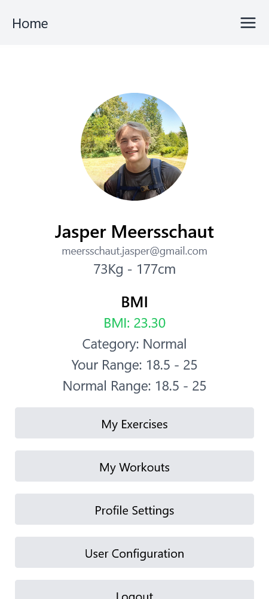
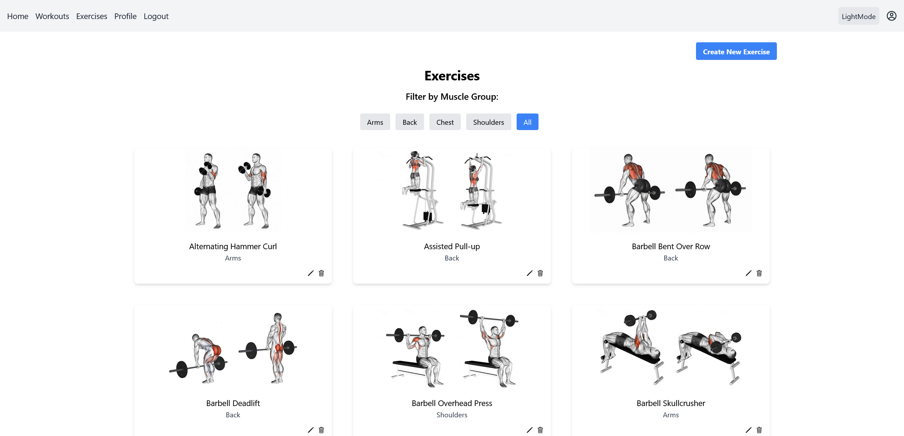
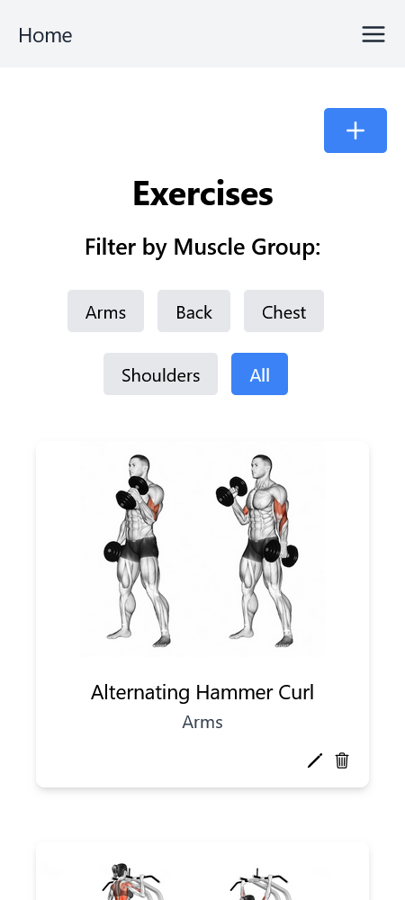
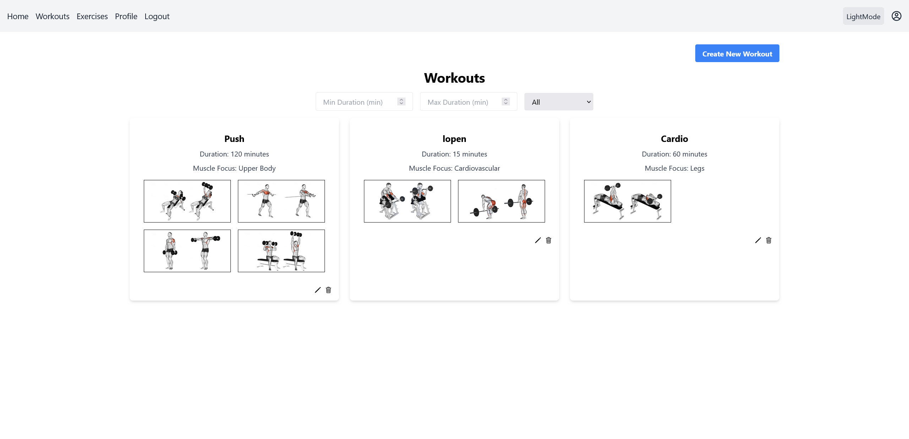
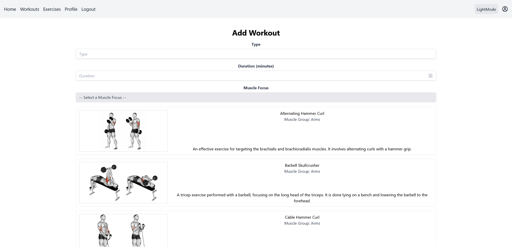
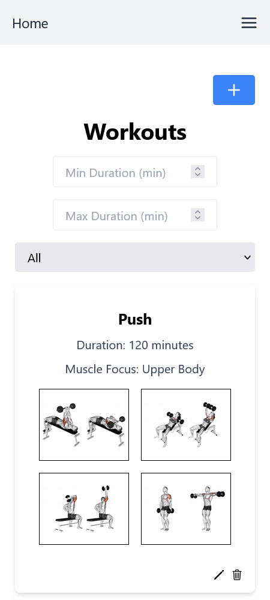
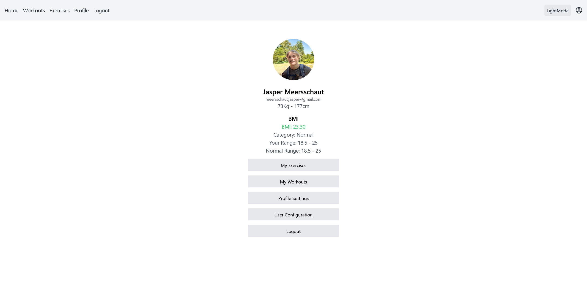

# Dossier
- Student: Jasper Meersschaut
- Studentennummer: 202396570
- E-mailadres: [jasper.meersschaut@student.hogent.be](mailto:jasper.meersschaut@student.hogent.be)
- Demo: [Panopto](https://hogent.cloud.panopto.eu/Panopto/Pages/Viewer.aspx?id=1de312db-719d-4e2d-b5b8-b246010bb2b7)
- GitHub-repository: [GitHub Repository](https://github.com/HOGENT-frontendweb/frontendweb-2425-JasperMeersschaut)
- Front-end Web Development
  - Online versie: https://frontendweb-jaspermeersschaut.onrender.com
- Web Services:
  - Online versie: https://webservices-jaspermeersschaut.onrender.com

## Logingegevens

### Lokaal
#### Admin:
- Gebruikersnaam/e-mailadres: meersschaut.jasper@gmail.com
- Wachtwoord: 12345678

#### User:
- Gebruikersnaam/e-mailadres: marie.dubois@example.com
- Wachtwoord: 12345678

### Online
#### Admin:
- Gebruikersnaam/e-mailadres: meersschaut.jasper@gmail.com
- Wachtwoord: 12345678

#### User:
- Gebruikersnaam/e-mailadres: marie.dubois@example.com
- Wachtwoord: 12345678

## Projectbeschrijving
 Mijn project heet gymstats. Je kan op mijn website oefeningen bekijken met daarbij de uitleg en een video van de oefening. Je kan ook een profiel aanmaken en je eigen workouts maken met bestaande oefeningen. Er zijn ook standaard workouts voor beginners die niet echt weten hoe een workout in elkaar zit. Je kan ook je BMI berekenen op de profiel pagina.
### Gebruikers
- Een user 
  - kan zich registreren
  - kan inloggen
  - kan oefeningen bekijken
  - kan workouts bekijken
  - kan zijn eigen workouts maken
  - kan zijn BMI berekenen
- Een admin
  - kan oefeningen toevoegen
  - kan standaard workouts toevoegen die iedereen kan zien
  - kan oefeningen en workouts aanpassen
  - kan oefeningen en workouts verwijderen
  - kan gebruikers bekijken, rollen aanpassen en verwijderen

### Oefeningen
- Een oefening heeft een naam, beschrijving, spiergroep, afbeelding en video.
- Een oefening kan toegevoegd, aangepast en verwijderd worden door een admin.
- Elke user ziet dezelfde oefeningen.

### Workouts
- Een workout heeft een naam, beschrijving, lengte, spier focus en een lijst van oefeningen.
- Een standaard workout kan toegevoegd, aangepast en verwijderd worden door een admin.
- Een user kan zijn eigen workout maken met bestaande oefeningen.

### ERD

[Link naar ERD](https://kroki.io/erd/svg/eNplj8EKgzAMhu95Cs8OD77CmBu77DY8yJCuDbZMrSQp6tuvToWBlz_hT778pHoy0gtSZ6BXHUKrWB5Lg51yLTBO8HYk1iiJQ-wbsTCia6zAoJhHT6a2ii2Qb5EBqmJC0o5xvSnzgNAF1i3eyIcBDLImN4jzfVwuPX18kL9dE0j9hit09TowaMIYb85zRGrcAsSPO31Ki_slahkVloeSPMvSZLsOW13NIw9HK0mzLE_2V7791WbD)

## Screenshots

### Home

### Exercises

### Workouts

### Profile

### Navbar

## API calls

> Swagger documentatie: [Swagger](http://localhost:9000/swagger)

#### Gebruikers
- `GET /api/users`: alle gebruikers ophalen
- `GET /api/users/{id}`: gebruiker met een bepaald id ophalen of je eigen informatie als je 'me' als id gebruikt
- `POST /api/users`: een nieuwe gebruiker registreren
- `PUT /api/users/{id}`: een bestaande gebruiker bijwerken
- `PUT /api/users/{id}/roles`: gebruikersrollen bijwerken
- `DELETE /api/users/{id}`: een gebruiker verwijderen op basis van id

#### Sessies
- `POST /api/sessions`: proberen in te loggen

#### Oefeningen
- `GET /api/exercises`: alle oefeningen ophalen
- `GET /api/exercises/{id}`: een oefening ophalen op basis van id
- `POST /api/exercises`: een nieuwe oefening aanmaken
- `PUT /api/exercises/{id}`: een oefening bijwerken op basis van id
- `DELETE /api/exercises/{id}`: een oefening verwijderen op basis van id
- `GET /api/exercises/muscle-groups`: alle spiergroepen ophalen

#### Workouts
- `GET /api/workouts`: alle workouts ophalen
- `GET /api/workouts/{id}`: een workout ophalen op basis van id
- `POST /api/workouts`: een nieuwe workout aanmaken
- `PUT /api/workouts/{id}`: een workout bijwerken op basis van id
- `DELETE /api/workouts/{id}`: een workout verwijderen op basis van id
- `GET /api/workouts/muscle-focuses`: alle spierfocusgebieden ophalen

#### Health
- `GET /api/health/ping`: de server pingen
- `GET /api/health/version`: de versie-informatie van de server ophalen

#### BMI
- `GET /api/bmi`: BMI-gegevens ophalen op basis van de lengte en het gewicht van de ingelogde gebruiker

## Behaalde minimumvereisten

### Front-end Web Development

#### Componenten

- [x] heeft meerdere componenten - dom & slim (naast login/register)
- [x] applicatie is voldoende complex
- [x] definieert constanten (variabelen, functies en componenten) buiten de component 
- [x] minstens één form met meerdere velden met validatie (naast login/register)
- [x] login systeem

#### Routing

- [x] heeft minstens 2 pagina's (naast login/register)
- [x] routes worden afgeschermd met authenticatie en autorisatie

#### State management

- [x] meerdere API calls (naast login/register)
- [x] degelijke foutmeldingen indien API-call faalt
- [x] gebruikt useState enkel voor lokale state
- [x] gebruikt gepast state management voor globale state - indien van toepassing

#### Hooks

- [x] gebruikt de hooks op de juiste manier

#### Algemeen

- [x] een aantal niet-triviale én werkende e2e testen
- [x] minstens één extra technologie
- [x] node_modules, .env, productiecredentials... werden niet gepushed op GitHub
- [x] maakt gebruik van de laatste ES-features (async/await, object destructuring, spread operator...)
- [x] de applicatie start zonder problemen op gebruikmakend van de instructies in de README
- [x] de applicatie draait online
- [x] duidelijke en volledige README.md
- [x] er werden voldoende (kleine) commits gemaakt
- [x] volledig en tijdig ingediend dossier

### Web Services

#### Datalaag

- [x] voldoende complex en correct (meer dan één tabel (naast de user tabel), tabellen bevatten meerdere kolommen, 2 een-op-veel of veel-op-veel relaties)
- [x] één module beheert de connectie + connectie wordt gesloten bij sluiten server
- [x] heeft migraties - indien van toepassing
- [x] heeft seeds

#### Repositorylaag

- [x] definieert één repository per entiteit - indien van toepassing
- [x] mapt OO-rijke data naar relationele tabellen en vice versa - indien van toepassing
- [x] er worden kindrelaties opgevraagd (m.b.v. JOINs) - indien van toepassing

#### Servicelaag met een zekere complexiteit

- [x] bevat alle domeinlogica
- [x] er wordt gerelateerde data uit meerdere tabellen opgevraagd
- [x] bevat geen services voor entiteiten die geen zin hebben zonder hun ouder (bv. tussentabellen)
- [x] bevat geen SQL-queries of databank-gerelateerde code

#### REST-laag

- [x] meerdere routes met invoervalidatie
- [x] meerdere entiteiten met alle CRUD-operaties
- [x] degelijke foutboodschappen
- [x] volgt de conventies van een RESTful API
- [x] bevat geen domeinlogica
- [x] geen API calls voor entiteiten die geen zin hebben zonder hun ouder (bv. tussentabellen)
- [x] degelijke autorisatie/authenticatie op alle routes

#### Algemeen

- [x] er is een minimum aan logging en configuratie voorzien
- [x] een aantal niet-triviale én werkende integratietesten (min. 1 entiteit in REST-laag >= 90% coverage, naast de user testen)
- [x] node_modules, .env, productiecredentials... werden niet gepushed op GitHub
- [x] minstens één extra technologie die we niet gezien hebben in de les
- [x] maakt gebruik van de laatste ES-features (async/await, object destructuring, spread operator...)
- [x] de applicatie start zonder problemen op gebruikmakend van de instructies in de README
- [x] de API draait online
- [x] duidelijke en volledige README.md
- [x] er werden voldoende (kleine) commits gemaakt
- [x] volledig en tijdig ingediend dossier

## Projectstructuur

### Front-end Web Development
#### mappenStructuur
gymstats-frontend/
- **cypress/** -> Bevat de cypress e2e testen
- **public/** -> Bevat de statische bestanden
- **src/** -> Bevat de broncode 
  - **api/** -> Bevat de API calls naar de backend
  - **contexts/** -> Bevat de globale states
  - **components/** -> Bevat de componenten
  - **pages/** -> Bevat de pagina's

### Web Services
#### mappenStructuur

gymstats-webservice/
- **\_\_test\_\_/** -> Bevat de testen 
- **config/** -> Bevat de configuratie
- **public/** -> Bevat de statische bestanden
- **src/** -> Bevat de broncode
  - **core/** 
  - **data/**
  - **rest/** 
  - **services/** 
  - **types/** 

## Extra technologie

### Front-end Web Development

#### Tailwind CSS
 Ik heb tailwind gebruikt omdat het me interesant leek. Ik heb al mooie resultaten gezien met tailwind en dit project leek mij een moment om het zelf eens te proberen.

 Tailwind is een utility-first CSS framework waarmee je snel en efficiënt stijlen kunt toepassen op je HTML-elementen zonder dat je zelf CSS hoeft te schrijven. 

 **Werking**:
  - Je voegt de tailwind classes toe aan je HTML-elementen.
  - Tailwind genereert een CSS-bestand met alle stijlen die je hebt toegevoegd.
  - Je kan de stijlen van je elementen aanpassen door de tailwind classes aan te passen.

[Tailwind](https://www.npmjs.com/package/tailwindcss)
### Web Services
#### Externe API (RapidAPI)
Ik heb een externe API gebruikt in mijn project. Deze wordt aangesproken door de backend, de key zit in de .env file. De API die ik gebruik is de "Smart Body Mass Index Calculator (BMI) API". Deze API berekent de BMI van een persoon op basis van zijn lengte en gewicht.

**Werking**:
- Op de profiel pagina wordt er een GET call gedaan naar de `api/index.ts` file.
- De index.js file roept de backend API aan.
- De backend API doet een call naar de externe API en geeft de lengte en het gewicht van de ingelogde gebruiker mee.
- De externe API berekent de BMI van de gebruiker en geeft deze terug aan de backend API.
- De backend API geeft de BMI van de gebruiker terug aan de index.js file.
- De index.js file geeft de BMI van de gebruiker terug aan de profiel pagina.

[Smart Body Mass Index Calculator](https://rapidapi.com/andreabaragiola/api/smart-body-mass-index-calculator-bmi)

> ❗Deze API is betalend, ik ga deze laten draaien tot 11/02/2025. Indien dit langer moet gelieve mij te mailen op [jasper.meersschaut@student.hogent.be](mailto:jasper.meersschaut@student.hogent.be)

## Gekende bugs

### Front-end Web Development
- Soms op render komt er een error `r is undefined` of `n is undefined`. Ik denk dat dit gewoon een bug van render is. Als je de pagina herlaad is het weg. (soms zelf meerdere keren)

### Web Services
/

## Reflectie

Ik vond het een zeer leuk project. De cursus zat goed in elkaar en de lessen waren ook leerzaam. Ik vond het leuk om aan het project te werken en ben blij met het resultaat. Er zijn nog een aantal functionaliteiten dat ik kon toevoegen maar voor het schoolproject aspect heb ik wel genoeg denk ik. 

Het enige waar ik het wat moeilijk mee had was de minimumvereisten/puntenverdeling. Ik vond het soms moeilijk om te weten of ik nu aan een bepaalde vereiste voldeed of niet. Bijvoorbeeld bij het puntje `definieert constanten (variabelen, functies en componenten) buiten de component` was het soms zoeken. Ik heb geprobeerd om dit te doen maar ik weet niet of ik het juist heb gedaan. En dan vraag ik mij af, als je dan 1 constante niet goed doet verlies je dan al een gewicht op dit punt? Dus dat was soms eens twijfelen.